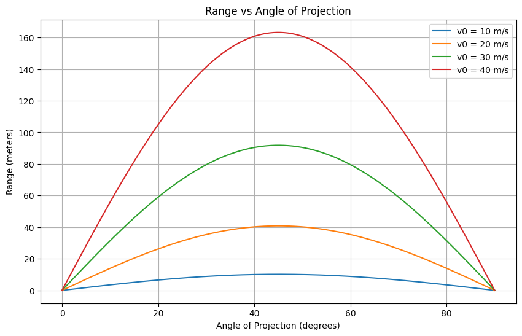
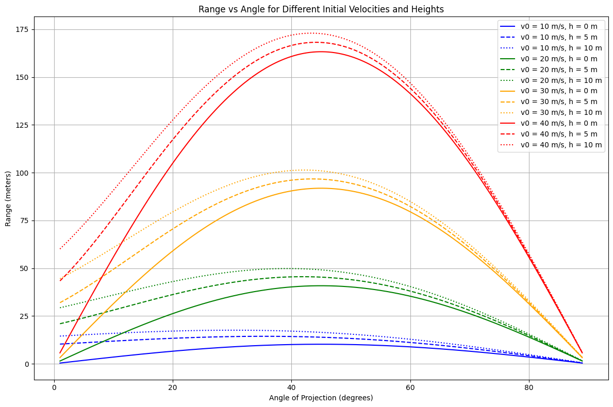

# Problem 1

## Investigating the Range as a Function of the Angle of Projection

### 1. Theoretical Foundation

Projectile motion describes the motion of an object launched into the air under the influence of gravity, assuming no air resistance. The path followed is a parabola.
Let’s consider an object projected with initial velocity \( v_0 \) at an angle \( \theta \) from the horizontal:

- Horizontal motion:
  $$ x(t) = v_0 \cos(\theta) \cdot t $$
- Vertical motion:
  $$ y(t) = v_0 \sin(\theta) \cdot t - \frac{1}{2} g t^2 $$

Where:

- \( v_0 \) - is the initial velocity,
- \( \theta \) - is the angle of projection,
- \( g \) - is gravitational acceleration (9.8 m/s\(^2\)),
- \( t \) - is time.

The **range** \( R \) of the projectile is the horizontal distance it travels before hitting the ground again. When launched from ground level and landing at the same height, the total time of flight is:

$$ T = \frac{2v_0 \sin(\theta)}{g} $$

---
#### 💡Why Capital T?

- Capital **T** is conventionally used to represent a total or final time — for example, the entire duration from launch to landing.
-	Lowercase **t** usually represents time as a variable, like time at any given moment during the motion.


So, in projectile motion:

- t → any time during the motion (like “at 2 seconds”)

-	T → total time the object is in the air (from launch to landing)


Example:

- The vertical position:

$$ y(t)=v0sin⁡(θ)⋅t−12gt2y(t) = v_0 \sin(\theta) \cdot t - \frac{1}{2}gt^2  $$
(Here t is changing continuously)

- But to find when the projectile lands, we solve for the total time → that’s when we use T:

$$ T=2v0sin⁡(θ)gT = \frac{2v_0 \sin(\theta)}{g} $$


Symbol	Meaning

-  **t**	- Any time during motion
-  **T**	- Total time of flight

---
Plugging this into the horizontal equation, we get the **range formula**:

$$ R = \frac{v_0^2 \sin(2\theta)}{g} $$

This formula shows:

- The range is maximum when \( \sin(2\theta) = 1 \), which occurs at \( \theta = 45^\circ \).
- For every angle \( \theta \), there is a complementary angle \( 90^\circ - \theta \) that produces the same range.

**Important**: The range is maximum when \( \sin(2\theta) = 1 \) \(\rightarrow\) \( \theta = 45^\circ \)

---

### 2. Analysis of the Range

The range of a projectile depends on several factors:

- **Angle of Projection**: The range increases as the angle rises from 0° to 45°, reaching a maximum at 45°, and then decreases symmetrically up to 90°.

  - At **0°** or **90°**, the range is **zero**.
  - **Maximum range** occurs at **45°**.

- **Initial Velocity \(v_0\)**: The range is proportional to the square of the initial speed:

  $$ R \propto v_0^2 $$

  Doubling the speed results in **four times** the range.

- **Gravitational Acceleration \( g \)**: A higher gravitational force reduces the range. For example, under stronger gravity (like on Jupiter), the same launch would travel a shorter distance.

To visualize these effects, I wrote a Python script that:

- Simulates projectile motion across angles from 0° to 90°
- Allows adjustment of \( v_0 \) and \( g \)
- Plots **Range vs. Angle** for different values of initial velocity

The resulting graph confirms theoretical predictions: a **symmetric curve peaking at 45°**, clearly showing how both angle and velocity influence range.

---

### 3. Practical Applications

The ideal model described above assumes:

- No air resistance
- Flat terrain
- Launch and landing at the same height

In real-world situations, these assumptions rarely hold. For example:

- **Sports**: In games like soccer, golf, or basketball, **air resistance** significantly affects the projectile's trajectory.
- **Engineering**: When launching objects from a catapult or cannon, factors like air drag and varying terrain must be accounted for.
- **Astrophysics**: Spacecraft trajectories are influenced by gravitational variations and other forces.
- **Military**: Ballistics and targeting systems must consider the impact of wind resistance and the curvature of the Earth.

These real-world factors can be addressed by more complex models, such as:

- **Drag force**:  
  $$ F_d = \frac{1}{2} C_d \rho A v^2 $$  
  where \( C_d \) is the drag coefficient, \( \rho \) is the air density, \( A \) is the cross-sectional area, and \( v \) is the velocity.

- **Numerical methods** to approximate motion, especially when analytical solutions are not feasible.

Despite these complexities, the basic idealized model remains a powerful starting point for understanding projectile motion, providing valuable insights into both simple and advanced systems.

---

### 4. Implementation (Python Script)

The simulation was implemented using Python and Matplotlib. The script computes the projectile's range over angles from 0° to 90° and generates a visual plot to illustrate the results.

Key features:

- Adjustable parameters like initial speed and gravity  
- Graphical output of Range vs. Angle  
- Ability to compare curves for multiple initial speeds

This visualization clearly shows how the peak and shape of the range curve change based on launch speed and gravitational acceleration.

A basic implementation using Matplotlib and NumPy is provided below.

```python
import numpy as np
import matplotlib.pyplot as plt

g = 9.8  # Gravitational acceleration (m/s^2)

# Toggle this to switch between basic (False) and extended (True) mode
extended = False

# Basic version: no initial height
def calculate_range_basic(v0, angle_deg):
    angle_rad = np.radians(angle_deg)
    R = (v0**2 * np.sin(2 * angle_rad)) / g
    return R

# Extended version: with initial height
def calculate_range_extended(v0, angle_deg, y0):
    angle_rad = np.radians(angle_deg)
    vx = v0 * np.cos(angle_rad)
    vy = v0 * np.sin(angle_rad)
    discriminant = vy**2 + 2 * g * y0
    if discriminant < 0:
        return 0
    T = (vy + np.sqrt(discriminant)) / g
    R = vx * T
    return R

v0_values = [10, 20, 30, 40]
angles = np.linspace(0, 90, 500)

plt.figure(figsize=(12, 8))

if not extended:
    # Basic version: Only velocity changes, height = 0
    for v0 in v0_values:
        ranges = [calculate_range_basic(v0, angle) for angle in angles]
        plt.plot(angles, ranges, label=f"v0 = {v0} m/s")
    plt.title("Range vs Angle of Projection (No Height)")
else:
    # Extended version: velocity + height combinations
    heights = [0, 5, 10]
    angles = np.linspace(1, 89, 500)
    colors = ['blue', 'green', 'orange', 'red']
    linestyles = ['-', '--', ':']

    for i, v0 in enumerate(v0_values):
        for j, y0 in enumerate(heights):
            ranges = [calculate_range_extended(v0, angle, y0) for angle in angles]
            label = f"v0 = {v0} m/s, h = {y0} m"
            plt.plot(angles, ranges, label=label, color=colors[i], linestyle=linestyles[j])
    plt.title("Range vs Angle for Different Initial Velocities and Heights")

plt.xlabel("Angle of Projection (degrees)")
plt.ylabel("Range (meters)")
plt.legend()
plt.grid(True)
plt.tight_layout()
plt.show()

```



---

### 5. Limitations and Improvements

While this project captures the essential behavior of projectile motion, it doesn't account for:

- Assumes no air resistance (idealized).
- Assumes flat terrain.
- Wind, spin, and shape of the projectile can significantly affect the real path.
- In real-world applications, numerical simulations or empirical data are needed.

In future versions, the model could be extended with numerical simulation using tools like Euler's method or integrating drag forces. Additionally, a 3D version could simulate real terrain or moving targets.

---

### Conclusion

This project offers both theoretical and visual insight into how the angle of projection affects the range of a projectile. Using fundamental equations of motion and simple Python code, we can clearly observe the mathematical beauty and real-world relevance of projectile motion.

