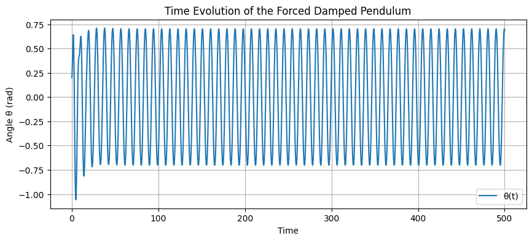
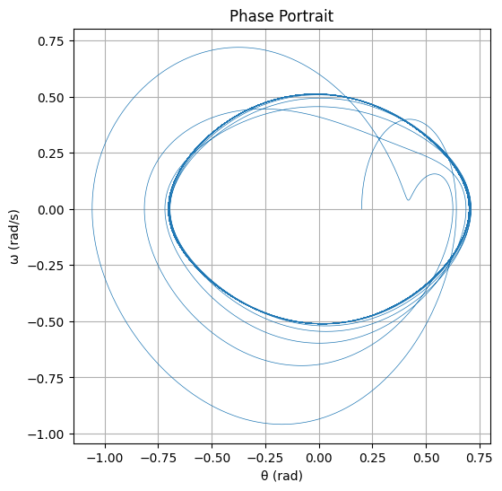
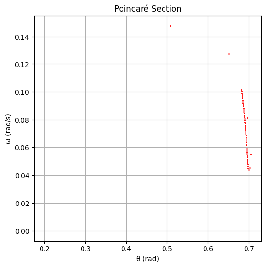

# Problem 2

##  Investigating the Dynamics of a Forced Damped Pendulum

---

## 1. Theoretical Foundation

### Governing Equation

The motion of a forced damped pendulum is described by the second-order, nonlinear differential equation:

$$
\frac{d^2\theta}{dt^2} + \gamma \frac{d\theta}{dt} + \omega_0^2 \sin(\theta) = A \cos(\omega t)
$$

Where:

- \(\theta(t)\): Angular displacement at time \(t\)
- \(\gamma\): Damping coefficient (e.g., due to air esistance or friction)
- \(\omega_0 = \sqrt{g/L}\): Natural frequency of the pendulum, depending on gravity and pendulum length
- \(A\): Amplitude of the driving force
- \(\omega\): Frequency of the driving force

This equation is nonlinear because of the \(\sin(\theta)\) term, making analytical solutions difficult or impossible for most cases.

---

###  Small-Angle Approximation

When the angular displacement is small (\(|\theta| < 15^\circ\)), we can simplify the equation by approximating \(\sin(\theta) \approx \theta\):

$$
\frac{d^2\theta}{dt^2} + \gamma \frac{d\theta}{dt} + \omega_0^2 \theta = A \cos(\omega t)
$$

This transforms the equation into a **linear second-order differential equation** similar to the driven harmonic oscillator, for which solutions are well-known. The steady-state solution takes the form:

$$
\theta(t) = \theta_0 \cos(\omega t - \phi)
$$

Where :

- \(\theta_0\) is the amplitude 
- \(\phi\) is the phase shift. 

This linear model helps us understand the resonance condition when \(\omega \approx \omega_0\), where the system absorbs the most energy and the oscillations grow in amplitude.

---

### ⚠️ Beyond Small Angles: Nonlinear Effects

As the angle increases, the linear approximation fails. The full nonlinear system shows:

- **Amplitude saturation**: Increasing drive no longer increases amplitude linearly.
- **Bifurcations**: Small parameter changes can lead to dramatic changes in behavior.
- **Chaotic dynamics**: Highly sensitive dependence on initial conditions.

---

## 2. Analysis of Dynamics

###  Parameter Sensitivity

We explore the effect of varying:

- **Damping (\(\gamma\))**: Controls energy dissipation. Higher damping suppresses oscillation amplitude and delays onset of chaos.
- **Driving amplitude (A)**: Low amplitude → regular motion; high amplitude → complex or chaotic motion.
- **Driving frequency (\(\omega\))**: Determines resonance and synchronization conditions.

###  Periodic vs. Chaotic Motion

- **Periodic motion**: Oscillations repeat over time, clearly visible in time plots and Poincaré sections.
- **Quasiperiodic motion**: Two or more incommensurate frequencies interacting.
- **Chaotic motion**: Aperiodic, sensitive to initial conditions, and unpredictable despite deterministic equations.

Chaotic regimes can be diagnosed using:

- **Phase space plots**: Reveal attractor shapes.
- **Poincaré sections**: Discrete snapshots each drive cycle, showing the transition to chaos.
- **Bifurcation diagrams**: Reveal how long-term behavior changes with a parameter (e.g., A or \(\omega\)).

---

## 3.  Real-World Applications

1. **Mechanical Systems**
   - **Suspension bridges**: Forced by wind, cars — nonlinear dynamics can cause resonant collapses (e.g., Tacoma Narrows Bridge).
   - **Shock absorbers**: Modeled as damped oscillators in cars and aircraft.

2. **Electrical Circuits**
   - **Driven RLC circuits** are analogs of the forced damped pendulum, with current as the analog of angular velocity.
   - **Signal processing** and **resonance tuning** use the same mathematics.

3. **Energy Harvesting**
   - Devices use environmental vibrations to generate electricity (e.g., from human motion, sea waves).
   - Operating at resonance increases efficiency.

4. **Biological Systems**
   - The gait cycle of walking/running resembles a forced oscillator.
   - Even heart rhythms and circadian clocks show resonance-like behavior.

---

## 4. Python Simulation & Visualizations

 We simulate the system using the **Runge-Kutta 4th order method** for accurate time-stepping of the nonlinear differential equation.

name: Deploy MkDocs to GitHub Pages

on:
  push:
    branches:
      - main  # Zmień na odpowiednią gałąź, jeśli używasz innej


📌 Included outputs:

- Time evolution of \(\theta(t)\)
- Phase space: \(\omega\) vs. \(\theta\)
- Poincaré section sampled every driving period

```python
import numpy as np
import matplotlib.pyplot as plt

# Parameters
gamma = 0.2          # Damping coefficient
omega_0 = 1.5        # Natural frequency
A = 1.2              # Driving amplitude
Omega = 2/3          # Driving frequency
dt = 0.01            # Time step
T = 500              # Total time
steps = int(T/dt)

# Initial conditions
theta = 0.2
omega = 0.0
t = 0.0

# Data storage
theta_list = []
omega_list = []
time_list = []
poincare_theta = []
poincare_omega = []

# Driving period for sampling
drive_period = (2 * np.pi) / Omega
sample_interval = int(drive_period / dt)

# Derivatives
def derivatives(theta, omega, t):
    dtheta_dt = omega
    domega_dt = -gamma * omega - omega_0**2 * np.sin(theta) + A * np.cos(Omega * t)
    return dtheta_dt, domega_dt

# Runge-Kutta 4th order method
for i in range(steps):
    time_list.append(t)
    theta_list.append(theta)
    omega_list.append(omega)

    if i % sample_interval == 0:
        poincare_theta.append(theta)
        poincare_omega.append(omega)

    k1_theta, k1_omega = derivatives(theta, omega, t)
    k2_theta, k2_omega = derivatives(theta + 0.5*dt*k1_theta, omega + 0.5*dt*k1_omega, t + 0.5*dt)
    k3_theta, k3_omega = derivatives(theta + 0.5*dt*k2_theta, omega + 0.5*dt*k2_omega, t + 0.5*dt)
    k4_theta, k4_omega = derivatives(theta + dt*k3_theta, omega + dt*k3_omega, t + dt)

    theta += (dt/6)*(k1_theta + 2*k2_theta + 2*k3_theta + k4_theta)
    omega += (dt/6)*(k1_omega + 2*k2_omega + 2*k3_omega + k4_omega)
    t += dt

    # Keep theta between -pi and pi
    if theta > np.pi:
        theta -= 2 * np.pi
    elif theta < -np.pi:
        theta += 2 * np.pi

# Time evolution plot
plt.figure(figsize=(10, 4))
plt.plot(time_list, theta_list, label='θ(t)')
plt.xlabel('Time')
plt.ylabel('Angle θ (rad)')
plt.title('Time Evolution of the Forced Damped Pendulum')
plt.grid(True)
plt.legend()
plt.show()

# Phase portrait
plt.figure(figsize=(6, 6))
plt.plot(theta_list, omega_list, linewidth=0.5)
plt.xlabel('θ (rad)')
plt.ylabel('ω (rad/s)')
plt.title('Phase Portrait')
plt.grid(True)
plt.show()

# Poincaré section
plt.figure(figsize=(6, 6))
plt.scatter(poincare_theta, poincare_omega, s=1, color='red')
plt.xlabel('θ (rad)')
plt.ylabel('ω (rad/s)')
plt.title('Poincaré Section')
plt.grid(True)
plt.show()
```

## OUTPUT :





---

## Results & Interpretations

- The **time series** plot shows how the angle evolves over time — regular, modulated, or chaotic.
- The **phase space plot** reveals attractor structure — periodic loops or scattered points.
- The **Poincaré section** helps distinguish periodic from chaotic regimes: points on a curve vs. scattered clouds.

Changing driving amplitude from 1.0 to 1.5 and frequency from 2/3 to 1.0 can lead to bifurcation and even full chaos.

---

## Limitations &  Extensions

### Limitations

- Assumes fixed-length, frictionless pivot.
- External force modeled as strictly sinusoidal.
- No coupling with other systems (single pendulum only).

### Extensions

- Add **nonlinear damping** (e.g., quadratic air resistance).
- Use **stochastic** or **impulse-based** driving forces.
- Simulate **coupled pendulums** or arrays to model synchronization.
- Explore **Lyapunov exponents** to quantify chaos.

---

## Conclusion

The forced damped pendulum beautifully illustrates the deep connection between simple physical laws and rich, sometimes unpredictable behaviors. Through mathematical modeling and simulation, we see how systems transition from harmony to chaos, with profound implications across disciplines. This study not only enhances our understanding of dynamic systems but also equips us to better design, control, and analyze critical real-world technologies.


