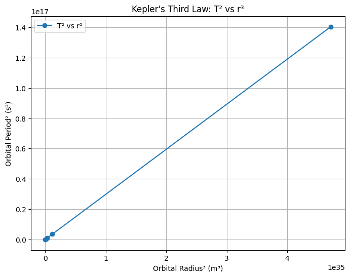

# Problem 1

# **Orbital Period and Orbital Radius**

---

## **1. Theoretical Derivation**

We start by considering a small body (like a satellite or planet) in **uniform circular motion** around a much larger mass \( M \), such as a star or planet.

### **Step 1: Centripetal Force**
For circular motion, the centripetal force is:

$$
F_c = \frac{mv^2}{r}
$$

Where:

- \( m \) is the mass of the orbiting body
- \( v \) is orbital speed
- \( r \) is the orbital radius

### **Step 2: Gravitational Force**
According to Newton's law of gravitation:

$$
F_g = \frac{G M m}{r^2}
$$

Where:

- \( G \) is the gravitational constant
- \( M \) is the central mass

### **Step 3: Equating the Forces**

$$
\frac{mv^2}{r} = \frac{GMm}{r^2}
\Rightarrow v^2 = \frac{GM}{r}
$$

### **Step 4: Expressing Orbital Period**

The orbital period \( T \) is:

$$
T = \frac{2\pi r}{v}
\Rightarrow T^2 = \left(\frac{2\pi r}{v}\right)^2 = \frac{4\pi^2 r^2}{v^2}
$$

Substitute \( v^2 = \frac{GM}{r} \):

$$
T^2 = \frac{4\pi^2 r^3}{GM}
$$

---

## **2. Implications for Astronomy**

### **Kepler’s Third Law (Simplified Form)**

$$
T^2 \propto r^3
$$

This equation shows that for any two bodies orbiting the same central mass, the ratio:

$$
\frac{T_1^2}{r_1^3} = \frac{T_2^2}{r_2^3}
$$

is constant. This law helps us:

- Determine the **mass of a central body** using orbital data.
- Estimate **distances** of celestial objects when their period is known.
- Understand **gravitational interactions** across star systems and galaxies.

---

## **3. Real-World Examples**

### **Moon’s Orbit Around Earth**

- Orbital radius: \( r \approx 3.84 \times 10^8 \) m  
- Orbital period: \( T \approx 27.3 \) days

You can use these values to verify:

$$
T^2 \approx \frac{4\pi^2 r^3}{G M_{\text{Earth}}}
$$

### **Planets in the Solar System**

For planets orbiting the Sun, plotting \( T^2 \) vs \( r^3 \) gives a straight line, verifying Kepler’s law. This helps calculate unknown planetary distances and supports heliocentric models.

---

## **4. Python Simulation and Visualization**

```python
import numpy as np
import matplotlib.pyplot as plt

# Constants
G = 6.67430e-11  # gravitational constant (m^3 kg^-1 s^-2)
M_sun = 1.989e30  # mass of the Sun (kg)

# Radii in meters (approximate) and periods in seconds
radii_km = np.array([57.9e6, 108.2e6, 149.6e6, 227.9e6, 778.6e6])  # Mercury to Jupiter in km
radii = radii_km * 1e3  # convert to meters
T = 2 * np.pi * np.sqrt(radii**3 / (G * M_sun))  # Orbital periods

# T^2 and r^3
T2 = T**2
r3 = radii**3

# Plotting
plt.figure(figsize=(8, 6))
plt.plot(r3, T2, 'o-', label='T² vs r³')
plt.xlabel('Orbital Radius³ (m³)')
plt.ylabel('Orbital Period² (s²)')
plt.title('Kepler\'s Third Law: T² vs r³')
plt.grid(True)
plt.legend()
plt.show()
```



This plot should show a linear relationship, confirming Kepler’s Third Law.

---

## **5. Extension to Elliptical Orbits**

Kepler’s original third law applies to **elliptical orbits** as well:

$$
T^2 \propto a^3
$$

Where \( a \) is the **semi-major axis** of the ellipse. This is significant for:

- Understanding the motion of comets and asteroids.
- Analyzing binary star systems.
- Calculating satellite orbits (e.g., GPS satellites which follow slightly elliptical paths).

---

## **Conclusion**

The relationship between orbital period and orbital radius not only provides insights into the motion of celestial bodies but also enables accurate modeling and prediction in astronomy and space exploration. From verifying Newtonian physics to helping design satellite trajectories, Kepler’s Third Law remains an indispensable tool in our understanding of the universe.

---
