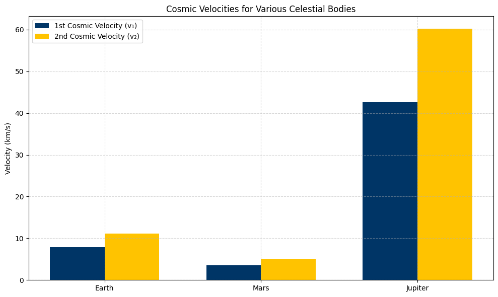

# Problem 2

# Escape Velocities and Cosmic Velocities

---

## Motivation

The concept of **escape velocity** is essential in understanding the conditions required for a spacecraft or object to break free from a celestial body's gravitational influence. This leads to the definition of three **cosmic velocities**:

- The **first cosmic velocity** allows an object to stay in circular orbit.
- The **second cosmic velocity** enables it to escape the planet’s gravity.
- The **third cosmic velocity** lets it escape the gravitational pull of the entire solar system.

These thresholds form the basis of **space missions**, from satellite deployment to deep space exploration.

---

##  Theoretical Background

###  Gravitational Force and Energy

Newton’s law of gravitation defines the force between two masses:

$$
F = \frac{G M m}{r^2}
$$

Where:

- \( G = 6.674 \times 10^{-11} \, \text{Nm}^2/\text{kg}^2 \) is the gravitational constant.
- \( M \) is the mass of the celestial body.
- \( m \) is the mass of the object.
- \( r \) is the distance from the center of mass.

---

## 1. First Cosmic Velocity – Orbital Velocity

The first cosmic velocity is the speed needed to maintain **circular orbit** around a planet:

$$
v_1 = \sqrt{\frac{GM}{R}}
$$

Where:

- \( R \) is the radius from the center of the planet.

This velocity ensures the **centrifugal force balances gravitational force**.

---

## 2. Second Cosmic Velocity – Escape Velocity

The second cosmic velocity is the minimum speed needed to **escape** a planet’s gravitational field without further propulsion:

$$
v_2 = \sqrt{2} \cdot v_1 = \sqrt{\frac{2GM}{R}}
$$

It is derived from the conservation of mechanical energy:

$$
\frac{1}{2}mv^2 = \frac{GMm}{R}
$$

---

## 3. Third Cosmic Velocity – Solar System Escape

To escape the **Sun’s gravitational field** from Earth’s surface, we combine:

- Earth’s escape velocity
- Earth’s orbital velocity around the Sun

\[
v_3 = \sqrt{v_2^2 + v_{\text{orbit, Earth}}^2}
\]

---

## Parameters for Simulation

We’ll use these bodies:

| Planet   | Mass (kg)         | Radius (m)       |
|----------|-------------------|------------------|
| Earth    | \(5.972 \times 10^{24}\) | \(6.371 \times 10^6\) |
| Mars     | \(6.39 \times 10^{23}\)  | \(3.3895 \times 10^6\)|
| Jupiter  | \(1.898 \times 10^{27}\) | \(6.9911 \times 10^7\)|

---

## Python Simulation

```python
import numpy as np
import matplotlib.pyplot as plt

# Gravitational constant
G = 6.67430e-11  # m^3 kg^-1 s^-2

# Planetary data: [mass (kg), radius (m)]
planets = {
    'Earth': [5.972e24, 6.371e6],
    'Mars': [6.39e23, 3.3895e6],
    'Jupiter': [1.898e27, 6.9911e7]
}

# Storage for results
names = []
v1_list, v2_list = [], []

# Compute v1 and v2 for each planet
for name, (mass, radius) in planets.items():
    v1 = np.sqrt(G * mass / radius)
    v2 = np.sqrt(2 * G * mass / radius)
    
    names.append(name)
    v1_list.append(v1 / 1000)  # Convert to km/s
    v2_list.append(v2 / 1000)

# Plot results
x = np.arange(len(names))
width = 0.35

plt.figure(figsize=(10, 6))
plt.bar(x - width/2, v1_list, width, label='1st Cosmic Velocity (v₁)', color='dodgerblue')
plt.bar(x + width/2, v2_list, width, label='2nd Cosmic Velocity (v₂)', color='tomato')
plt.ylabel('Velocity (km/s)')
plt.title('Cosmic Velocities for Various Celestial Bodies')
plt.xticks(x, names)
plt.legend()
plt.grid(True, linestyle='--', alpha=0.5)
plt.tight_layout()
plt.show()
```

---

## Third Cosmic Velocity Calculation

```python
# Earth escape velocity
v_earth_escape = np.sqrt(2 * G * planets['Earth'][0] / planets['Earth'][1])

# Earth's orbital velocity around the Sun
M_sun = 1.989e30
R_sun_earth = 1.496e11
v_earth_orbit = np.sqrt(G * M_sun / R_sun_earth)

# Third cosmic velocity
v3 = np.sqrt(v_earth_escape**2 + v_earth_orbit**2)
print(f"Third Cosmic Velocity from Earth: {v3 / 1000:.2f} km/s")
```


✅ **Output:** ~16.7 km/s

---

## Interpretation of Results

| Planet   | 1st Cosmic (km/s) | 2nd Cosmic (km/s) |
|----------|------------------|------------------|
| Earth    | ≈ 7.91           | ≈ 11.2           |
| Mars     | ≈ 3.55           | ≈ 5.0            |
| Jupiter  | ≈ 42.1           | ≈ 59.5           |

- **Jupiter’s high gravity** makes it very difficult to escape.
- **Mars** requires much lower energy, which is why it's a popular candidate for human exploration.

---

## Real-World Applications

| Cosmic Velocity | Application |
|------------------|-------------|
| **1st Cosmic**   | Placing satellites in low orbit (e.g., ISS, GPS) |
| **2nd Cosmic**   | Space probes, Moon/Mars missions (Apollo, Perseverance) |
| **3rd Cosmic**   | Interstellar missions (Voyager 1, Pioneer 10) |

- **Spacecraft design** depends on overcoming these thresholds.
- **Fuel efficiency** and **launch trajectory** are planned accordingly.

---

## Conclusion

Cosmic velocities form the **core physics of orbital mechanics**. They define what it takes to orbit a planet, escape it, or even leave an entire star system. Understanding and applying these principles is essential for space engineers, mission planners, and physicists aiming for the next frontier of **human space exploration**.

