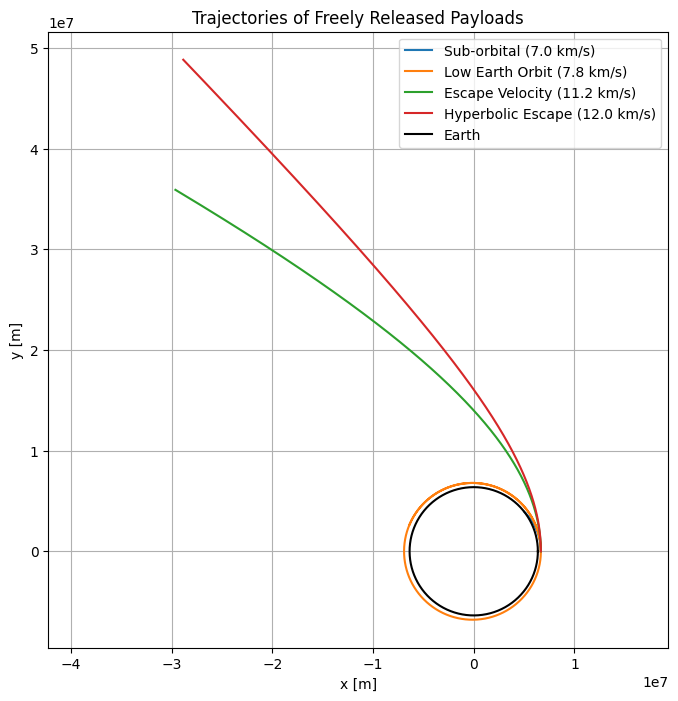

# Problem 3

# Trajectories of a Freely Released Payload Near Earth

---

## Motivation

When a payload is released from a moving spacecraft near Earth, its subsequent trajectory is determined by its initial velocity, altitude, and direction. This problem is a compelling application of orbital mechanics, offering insights into various possible outcomes such as:

- Stable orbits (elliptical or circular)

- Reentry trajectories

- Escape trajectories (parabolic or hyperbolic)

Depending on the initial conditions, the payload may enter a closed orbit, crash back to Earth, or escape Earth’s gravitational field. Understanding these motions is crucial for real-world space missions like satellite deployment, orbital transfers, space probes, reentry planning, and escape maneuvers.

---

## Theoretical Background

### Newton's Law of Universal Gravitation
The gravitational force acting on a payload of mass 𝑚 near Earth of mass 𝑀 is:

$$
F = \frac{G M m}{r^2}
$$

Where:

- \( F \) is the gravitational force,
- \( G = 6.674 \times 10^{-11}\, \text{Nm}^2/\text{kg}^2 \),
- \( M \) is Earth’s mass,
- \( m \) is the payload’s mass,
- \( r \) is the distance from Earth's center.

This force results in acceleration $a$:

$$
a = \frac{F}{m} = \frac{G M}{r^2}
$$


### Orbital Trajectory Classification

The shape of the trajectory depends on **total mechanical energy**:

$$
\varepsilon = \frac{1}{2}mv^2 - \frac{GMm}{r}
$$


| Trajectory Type | Total Energy \(E\)| Eccentricity \(e\) |
|-----------------|--------------------|---------------------|
| Circular Orbit  | \(< 0\)            | 0                   |
| Elliptical Orbit| \(< 0\)            | \(0 < e < 1\)       |
| Parabolic       | \(= 0\)            | 1                   |
| Hyperbolic      | \(> 0\)            | \(e > 1\)           |

---
### Escape Velocity

$$
v_{\text{esc}} = \sqrt{\frac{2GM}{r}}
$$

At Earth's surface (radius ≈ 6371 km), $v_{\text{esc}} \approx 11.2 \, \text{km/s}$

---

## Simulation Setup

We assume:

- 2D motion in a plane
- Central gravitational force from Earth
- No air resistance (vacuum)

We'll simulate the trajectory of a payload launched from **Earth’s low orbit** with different initial velocities.

---

## 2. Python Simulation

We’ll use a simple numerical method (Euler or Runge-Kutta) to compute and visualize trajectories.

```python
import numpy as np
import matplotlib.pyplot as plt

# Constants
G = 6.67430e-11        # Gravitational constant [m^3 kg^-1 s^-2]
M = 5.972e24           # Earth mass [kg]
R_earth = 6.371e6      # Earth radius [m]

# Initial conditions
altitude = 300e3  # 300 km above Earth's surface
r0 = R_earth + altitude
v_escape = np.sqrt(2 * G * M / r0)

# Time parameters
dt = 1.0       # time step [s]
t_max = 8000   # total time [s]

def simulate_trajectory(vx0, vy0):
    x, y = [r0], [0]
    vx, vy = [vx0], [vy0]
    t = [0]

    for _ in range(int(t_max/dt)):
        r = np.sqrt(x[-1]**2 + y[-1]**2)
        if r < R_earth:  # Crash condition
            break

        ax = -G * M * x[-1] / r**3
        ay = -G * M * y[-1] / r**3

        vx_new = vx[-1] + ax * dt
        vy_new = vy[-1] + ay * dt

        x_new = x[-1] + vx_new * dt
        y_new = y[-1] + vy_new * dt

        x.append(x_new)
        y.append(y_new)
        vx.append(vx_new)
        vy.append(vy_new)
        t.append(t[-1] + dt)

    return x, y, t

# Simulations
initial_speeds = [7000, 7800, 11200, 12000]  # m/s
labels = ["Sub-orbital", "Low Earth Orbit", "Escape Velocity", "Hyperbolic Escape"]

plt.figure(figsize=(8,8))
for v, label in zip(initial_speeds, labels):
    x, y, _ = simulate_trajectory(0, v)
    plt.plot(x, y, label=f"{label} ({v/1000:.1f} km/s)")

# Earth boundary
theta = np.linspace(0, 2*np.pi, 500)
earth_x = R_earth * np.cos(theta)
earth_y = R_earth * np.sin(theta)
plt.plot(earth_x, earth_y, 'k', label='Earth')

plt.xlabel("x [m]")
plt.ylabel("y [m]")
plt.title("Trajectories of Freely Released Payloads")
plt.axis("equal")
plt.grid(True)
plt.legend()
plt.show()
```
OUTPUT :



---

## Interpretation of Results

### 1. **Sub-Orbital Trajectory (e.g., 7000 m/s)**

* The payload is released at a velocity **below the orbital speed** required for a stable Low Earth Orbit (LEO).
* The gravitational force dominates and pulls the object back toward Earth.
* This type of trajectory is characteristic of **short missions**, like ballistic missiles or early suborbital spaceflights (e.g., V2 rockets or Alan Shepard's flight).
* The path appears **curved but not closed**, indicating that it doesn’t complete an orbit before reentry.

### 2. **Low Earth Orbit (e.g., 7800 m/s)**

* At this speed, the payload follows a **stable elliptical orbit**, where the gravitational force provides the necessary centripetal force to maintain its motion.
* This speed is close to the **first cosmic velocity** required for circular or near-circular orbit.
* Common for satellites and the International Space Station.
* The trajectory forms a **closed loop** (an ellipse), confirming it remains bound to Earth.

### 3. **Escape Velocity (≈11200 m/s)**

* At this critical velocity, the total mechanical energy of the object becomes zero:

  $$
  \varepsilon = \frac{v^2}{2} - \frac{GM}{r} = 0
  $$
* The payload follows a **parabolic trajectory** and reaches **infinite distance with zero velocity**, in theory.
* This is the **minimum speed** required to leave Earth’s gravity well **without further propulsion**.
* Used in mission planning for **interplanetary launches**.

### 4. **Hyperbolic Escape (e.g., 12000 m/s)**

* When the initial velocity exceeds escape velocity, the payload follows a **hyperbolic path**.
* The excess energy results in **continued acceleration away from Earth**, assuming no other forces act.
* Such trajectories are used when sending probes to **deep space** or for **gravity assists**.

---

## Real-World Applications

| Trajectory Type | Mission Example |
|-----------------|-----------------|
| Sub-orbital     | Space tourism, sounding rockets |
| Circular Orbit  | ISS, GPS, Earth Observation |
| Elliptical Orbit| Transfer orbits, Molniya satellites |
| Escape Trajectory| Moon missions, interplanetary probes (Voyager, Mars rovers) |
| Hyperbolic Path | Gravity assist maneuvers, escape trajectories |

---

## References

* Newton, I. *Philosophiæ Naturalis Principia Mathematica*.
* Vallado, D. A. (2001). *Fundamentals of Astrodynamics and Applications*.
* NASA: Orbital Mechanics Tutorials.

---
## Conclusion

By changing the **initial velocity** of a payload released from a moving spacecraft, we can achieve a wide range of **orbital trajectories** — from short-lived suborbital hops to interplanetary escapes. Understanding these dynamics is vital for mission design, space navigation, and satellite deployment.

The combination of **gravitational physics** and **numerical simulation** allows us to visualize and predict these complex motions in space.

