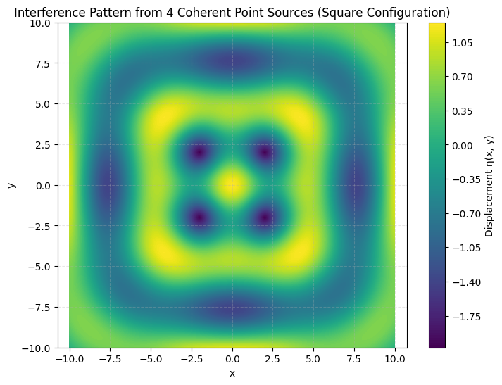

# Problem 1

# Interference Patterns on a Water Surface

---

## Motivation

Wave interference is a core phenomenon in wave physics, where two or more wavefronts overlap, resulting in a new wave pattern. On a water surface, this can be beautifully visualized as ripples that either amplify (constructive interference) or diminish (destructive interference) each other.

Studying interference from multiple coherent sources positioned at the vertices of a regular polygon reveals complex and symmetric wave structures. This offers a concrete example of wave superposition, coherence, and spatial phase relationships. The goal of this investigation is to explore the formation of interference patterns through simulation and visualization, enhancing our understanding of wave dynamics and their real-world applications.

---

## Theoretical Background

### Circular Water Waves from a Single Source

A circular wave propagating from a point source on a water surface can be described as:

$$
\eta_i(\vec{r}, t) = A \sin(k|\vec{r} - \vec{r}_i| - \omega t + \phi_i)
$$

Where:

* $\eta_i(\vec{r}, t)$ : Displacement at position $\vec{r}$ and time $t$ due to source $i$
* $A$: Amplitude of the wave
* $k = \frac{2\pi}{\lambda}$ : Wave number, related to wavelength $\lambda$
* $\omega = 2\pi f$ : Angular frequency, related to frequency $f$
* $|\vec{r} - \vec{r}_i|$ : Distance from the source to the point
* $\phi_i$ : Initial phase of source $i$

### Superposition Principle

When multiple wave sources are present, the total displacement at any point on the water surface is the **sum of all individual displacements**:

$$
\eta(\vec{r}, t) = \sum_{i=1}^{N} \eta_i(\vec{r}, t)
$$

This is the **principle of superposition**, which governs interference patterns.

### Interference Types

* **Constructive Interference**: Occurs when waves arrive in phase — peaks meet peaks, leading to higher amplitudes.
* **Destructive Interference**: Occurs when waves are out of phase — peaks meet troughs, resulting in cancellation.

---

## Problem Setup

### Polygon Selection

We choose a **square (4 vertices)** as the base geometry for placing wave sources. This setup allows us to explore symmetrical interference patterns resulting from coherent sources positioned at equal distances.

### Assumptions

* All sources emit waves of equal amplitude $A = 1$, frequency $f = 1$, and wavelength $\lambda = 2\pi$.
* All sources are coherent: same phase and frequency.
* Initial time is fixed at $t = 0$ for a static snapshot.
* Sources are located at the corners of a square centered at the origin.

---

## Python Simulation

```python
import numpy as np
import matplotlib.pyplot as plt

# Wave parameters
A = 1                       # Amplitude
wavelength = 2 * np.pi      # Wavelength
k = 2 * np.pi / wavelength  # Wave number
f = 1                       # Frequency
omega = 2 * np.pi * f       # Angular frequency
t = 0                       # Time snapshot

# Grid setup
x = np.linspace(-10, 10, 500)
y = np.linspace(-10, 10, 500)
X, Y = np.meshgrid(x, y)
eta_total = np.zeros_like(X)

# Source positions - square centered at origin
L = 4  # Side length
positions = [
    (-L/2, -L/2),
    (-L/2, L/2),
    (L/2, -L/2),
    (L/2, L/2)
]

# Superposition of waves
for (xi, yi) in positions:
    R = np.sqrt((X - xi)**2 + (Y - yi)**2)
    eta = A * np.sin(k * R - omega * t)
    eta_total += eta

# Plot
plt.figure(figsize=(8, 6))
plt.contourf(X, Y, eta_total, levels=150, cmap='viridis')
plt.colorbar(label='Displacement η(x, y)')
plt.title('Interference Pattern from 4 Coherent Point Sources (Square Configuration)')
plt.xlabel('x')
plt.ylabel('y')
plt.axis('equal')
plt.grid(True, linestyle='--', alpha=0.3)
plt.show()
```

---
OUTPUT:



## Graphical Visualization

The resulting plot shows:

* **Bright regions** where waves constructively interfere (higher amplitude)
* **Dark regions** where destructive interference occurs
* A **symmetrical, periodic pattern** due to the square geometry
* **Fringes** and circular ripple-like structures that radiate from the combined influence of all sources

---

## Interpretation of Results

The simulation confirms how interference depends heavily on **source arrangement** and **phase relationships**:

### - Constructive Interference

Occurs at points equidistant (or with equal path length difference in integer multiples of the wavelength) from multiple sources. These form **high-intensity bands** in the visualization.

### - Destructive Interference

Occurs where waves cancel each other due to opposite phase arrival, leading to **low or zero displacement** regions.

### - Symmetry

The square configuration leads to **reflectional and rotational symmetry** in the interference pattern. This symmetry helps identify **nodal lines** (where total displacement is zero) and **antinodal lines** (where displacement is maximum).

### - Effect of Geometry

If another polygon were chosen (e.g., triangle or pentagon), the interference pattern would change dramatically. The number of lobes, symmetry lines, and nodal spacing depends on both **distance between sources** and **angular separation**.

---

## Physical Significance and Applications

This simulation and analysis highlight core principles of wave interference, which are applicable in:

* **Acoustics**: Design of concert halls, speaker arrays
* **Optics**: Interference of light waves in thin films and interferometers
* **Antenna arrays**: Beamforming and directional signal control
* **Quantum mechanics**: Matter wave interference patterns
* **Water wave engineering**: Harbor design, wave reflection and absorption studies

---

## Conclusion

This task demonstrates how **coherent wave sources arranged in a regular pattern** can create rich and predictable interference structures. By leveraging numerical simulations, we can visualize these wave patterns and better understand the spatial and temporal dynamics of wave interactions. This approach provides a strong foundation for exploring more complex interference systems in physics and engineering.

---

