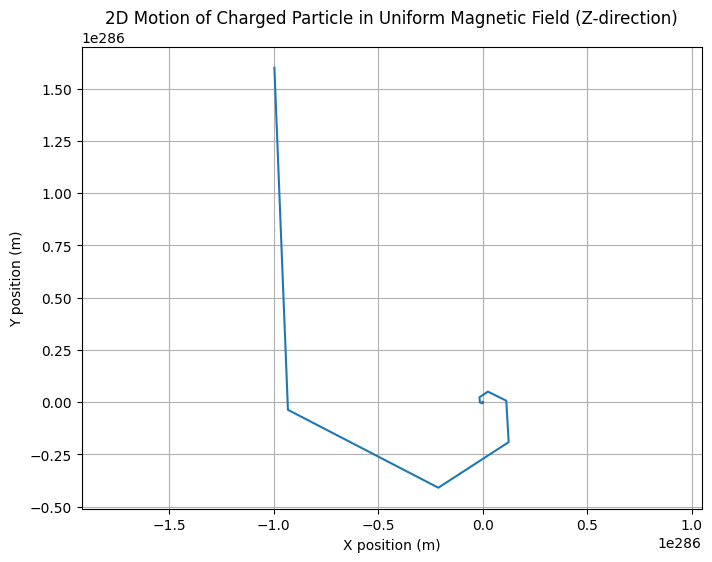
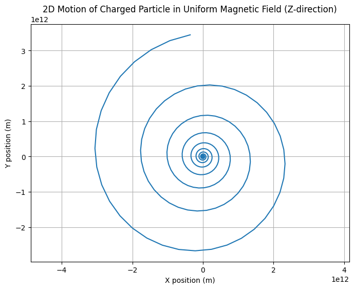
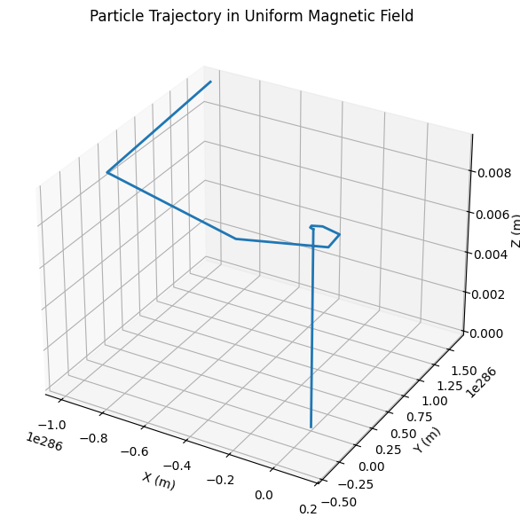

# Problem 1

#  Simulating the Effects of the Lorentz Force

---

## Motivation

The Lorentz force describes how charged particles behave when subjected to electric and magnetic fields. This force is foundational in numerous areas of physics and engineering, including:

* **Particle accelerators** (e.g., cyclotrons, synchrotrons)
* **Plasma physics** (e.g., magnetic confinement in fusion reactors)
* **Mass spectrometry**
* **Astrophysical phenomena** (e.g., motion of solar wind in magnetic fields)

The Lorentz force is given by:

$$
\vec{F} = q(\vec{E} + \vec{v} \times \vec{B})
$$

Simulating this force helps visualize complex motion like helical paths and electromagnetic drifts. It also provides intuition about how fields are used to control particles in real systems.

---

## 1. Exploration of Applications

### Key Systems

* **Cyclotrons:** Magnetic fields bend particle paths; electric fields accelerate them.
* **Mass Spectrometers:** Magnetic fields deflect particles based on their charge-to-mass ratio.
* **Fusion Reactors (Tokamaks):** Charged plasma is confined using toroidal magnetic fields.
* **Cathode Ray Tubes:** Magnetic deflection steers electron beams.

### Field Interactions

* **Electric Field $\vec{E}$ :** Changes particle speed (linear acceleration).
* **Magnetic Field $\vec{B}$ :** Changes direction via circular or helical motion. Does no work.

---

## 2. Simulating Particle Motion

We solve Newton’s second law with the Lorentz force:

$$
m \frac{d\vec{v}}{dt} = q(\vec{E} + \vec{v} \times \vec{B}),  \quad \frac{d\vec{r}}{dt} = \vec{v}
$$

We'll use the **Euler method** for numerical integration.

---

### Python Simulation (Uniform Magnetic Field)
#### 2D version
```python
import numpy as np
import matplotlib.pyplot as plt

# Constants
q = 1.6e-19         # Charge (C)
m = 9.11e-31        # Mass (kg)
Bz = 1              # Magnetic field in z-direction (T)
Ex, Ey = 0, 0       # Electric field components (V/m)

# Simulation parameters
dt = 1e-11          # Time step (s)
steps = 1000        # Number of steps

# Initial conditions
r = np.zeros((steps, 2))  # [x, y]
v = np.zeros((steps, 2))  # [vx, vy]
r[0] = [0, 0]
v[0] = [1e6, 0]  # Initial velocity in X only

# Euler Integration
for i in range(steps - 1):
    vx, vy = v[i]
    Fx = q * (Ex + vy * Bz)
    Fy = q * (Ey - vx * Bz)
    ax, ay = Fx / m, Fy / m
    v[i+1] = v[i] + dt * np.array([ax, ay])
    r[i+1] = r[i] + dt * v[i]

# Plot trajectory
plt.figure(figsize=(8, 6))
plt.plot(r[:, 0], r[:, 1])
plt.title("2D Motion of Charged Particle in Uniform Magnetic Field (Z-direction)")
plt.xlabel("X position (m)")
plt.ylabel("Y position (m)")
plt.grid(True)
plt.axis('equal')
plt.show()

```
OUTPUT : 


---

### ⚠️ Note:

The initial velocity of `1e6 m/s` (1,000,000 m/s) is quite large and results in a very fast, tightly curved motion. If you'd like to **slow down the particle** and make the trajectory easier to observe, we can reduce this value.
Try setting the initial velocity to a moderate value, such as:

Try setting the initial velocity to a **moderate value**, such as:

✅ Recommended Adjustment:

```python
import numpy as np
import matplotlib.pyplot as plt

# Constants
q = 1.6e-19         # Charge (C)
m = 9.11e-31        # Mass (kg)
Bz = 1              # Magnetic field in z-direction (T)
Ex, Ey = 0, 0       # Electric field components (V/m)

# Simulation parameters
dt = 1e-12          # Time step (s) - slower for better resolution
steps = 3000        # Increased steps for better trajectory visualization

# Initial conditions
r = np.zeros((steps, 2))  # [x, y]
v = np.zeros((steps, 2))  # [vx, vy]
r[0] = [0, 0]
v[0] = [1e4, 0]  # Reduced initial velocity in X (10,000 m/s) - change this to test

# Euler Integration
for i in range(steps - 1):
    vx, vy = v[i]
    Fx = q * (Ex + vy * Bz)
    Fy = q * (Ey - vx * Bz)
    ax, ay = Fx / m, Fy / m
    v[i+1] = v[i] + dt * np.array([ax, ay])
    r[i+1] = r[i] + dt * v[i]

# Plot trajectory
plt.figure(figsize=(8, 6))
plt.plot(r[:, 0], r[:, 1])
plt.title("2D Motion of Charged Particle in Uniform Magnetic Field (Z-direction)")
plt.xlabel("X position (m)")
plt.ylabel("Y position (m)")
plt.xlim(-0.05, 0.05)  # Adjust x-axis limits for better visibility
plt.ylim(-0.05, 0.05)  # Adjust y-axis limits for better visibility
plt.grid(True)
plt.axis('equal')
plt.show()
```

OUTPUT : 


In a 2D simulation, especially with a relatively small number of steps and a fixed time step, it can be hard to visually distinguish between large and reduced initial velocities because the trajectory might be too compressed, or the time step might not be fine enough to see the effects of the change.

To better visualize the difference between a large and reduced initial velocity in the **2D version**, we need to make a few adjustments:

**1. Increase the number of steps (to give more time for the particle to travel)**

**2. Adjust the plot's axes limits for a clearer view of the trajectory**

**3. Use a slower time step** if needed to increase the resolution of motion.

### Key Changes:

1. **Time Step (`dt`) Adjusted:** The time step is decreased to `1e-12` to give the particle more time to move in each step and create a smoother path.
2. **Number of Steps Increased:** The number of steps has been increased to `3000` to give more time for the particle's motion to be captured, so the difference between high and low velocities will be more noticeable.
3. **Adjusted Axes Limits:** The `xlim` and `ylim` parameters were set to limits that will make the motion more visible on the plot. You can adjust these further depending on the particle's path.

---

### **Visualizing Large vs. Reduced Velocity:**

To visually compare the **large initial velocity** with the **reduced initial velocity**, you can:

* Run the simulation twice: first with `v[0] = [1e6, 0]` (large velocity) and second with `v[0] = [1e4, 0]` (reduced velocity).
* Plot both on the same graph or use subplots to compare the differences.

---

This will:

* Make the **cyclotron radius smaller** (since radius ∝ velocity)
* Produce a **tighter and clearer spiral or circular path**
* Keep the simulation stable (especially at your time step of `1e-11 s`)

If the velocity is **too small** (e.g., `1e2`), the particle might barely move during the simulated time. We can balance this by:

* Adjusting the number of steps (e.g., increase to `2000`)
* Or increasing the time step slightly (e.g., `dt = 5e-11`), if needed — just keep in mind that too large a `dt` can reduce accuracy.

---

#### 3D version
```python
import numpy as np
import matplotlib.pyplot as plt
from mpl_toolkits.mplot3d import Axes3D

# Constants
q = 1.6e-19         # Charge (C)
m = 9.11e-31        # Mass (kg) - electron
B = np.array([0, 0, 1])  # Uniform magnetic field (T)
E = np.array([0, 0, 0])  # No electric field

# Simulation parameters
dt = 1e-11          # Time step (s)
steps = 1000        # Number of time steps
t = np.linspace(0, dt*steps, steps)

# Initial conditions
v = np.zeros((steps, 3))
r = np.zeros((steps, 3))
v[0] = np.array([1e6, 0, 1e6])  # Initial velocity (m/s)
r[0] = np.array([0, 0, 0])      # Initial position

# Euler integration loop
for i in range(steps - 1):
    F = q * (E + np.cross(v[i], B))
    a = F / m
    v[i+1] = v[i] + a * dt
    r[i+1] = r[i] + v[i] * dt

# 3D trajectory plot
fig = plt.figure(figsize=(10, 6))
ax = fig.add_subplot(111, projection='3d')
ax.plot(r[:,0], r[:,1], r[:,2], lw=2)
ax.set_xlabel('X (m)')
ax.set_ylabel('Y (m)')
ax.set_zlabel('Z (m)')
ax.set_title('Particle Trajectory in Uniform Magnetic Field')
plt.tight_layout()
plt.show()
```
OUTPUT :



---

## 3. Parameter Exploration

Try modifying the following:

* **Electric Field :** `E = np.array([1e3, 0, 0])`
* **Initial Velocity Direction :** `v[0] = np.array([0, 1e6, 0])`
* **Particle Type (Proton) :** `m = 1.67e-27`, `q = 1.6e-19`

You can also compute:

* **Larmor Radius:**

  $$
  r_L = \frac{mv_\perp}{|q|B}
  $$

* **Cyclotron Frequency:**

  $$
  \omega_c = \frac{|q|B}{m}
  $$

* **E×B Drift Velocity:**

  $$
  \vec{v}_d = \frac{\vec{E} \times \vec{B}}{B^2}
  $$

---

## Conclusion

Through this simulation, we've visualized how charged particles move under electromagnetic forces. Key observations include:

* **Circular or helical motion** in a magnetic field.
* **Drift motion** in crossed electric and magnetic fields.
* The **role of particle mass and charge** in determining radius and frequency.

Such simulations are fundamental for understanding and designing systems like **cyclotrons**, **mass spectrometers**, and **fusion reactors**. By adjusting parameters, we can analyze how field strengths and particle properties influence motion — offering a practical bridge between theoretical physics and real-world applications.

---


