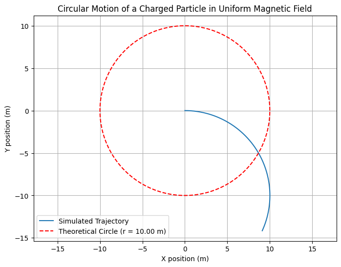
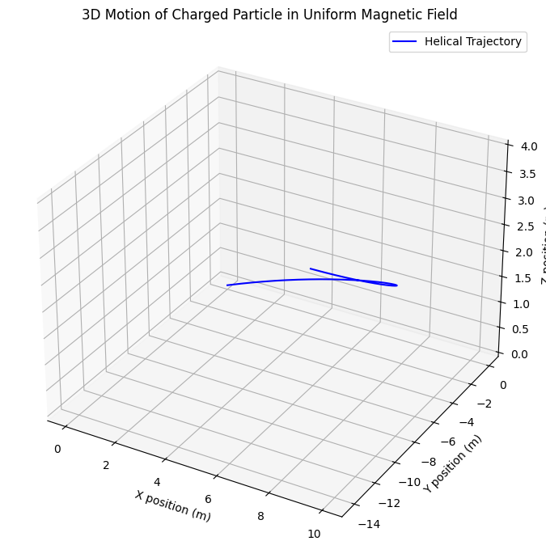

# Problem 1

#  Simulating the Effects of the Lorentz Force

---

## Motivation

The Lorentz force describes how charged particles behave when subjected to electric and magnetic fields. This force is foundational in numerous areas of physics and engineering, including:

* **Particle accelerators** (e.g., cyclotrons, synchrotrons)
* **Plasma physics** (e.g., magnetic confinement in fusion reactors)
* **Mass spectrometry**
* **Astrophysical phenomena** (e.g., motion of solar wind in magnetic fields)

The Lorentz force is given by:

$$
\vec{F} = q(\vec{E} + \vec{v} \times \vec{B})
$$

Simulating this force helps visualize complex motion like helical paths and electromagnetic drifts. It also provides intuition about how fields are used to control particles in real systems.

---

## 1. Exploration of Applications

### Key Systems

* **Cyclotrons:** Magnetic fields bend particle paths; electric fields accelerate them.
* **Mass Spectrometers:** Magnetic fields deflect particles based on their charge-to-mass ratio.
* **Fusion Reactors (Tokamaks):** Charged plasma is confined using toroidal magnetic fields.
* **Cathode Ray Tubes:** Magnetic deflection steers electron beams.

### Field Interactions

* **Electric Field $\vec{E}$ :** Changes particle speed (linear acceleration).
* **Magnetic Field $\vec{B}$ :** Changes direction via circular or helical motion. Does no work.

---

## 2. Simulating Particle Motion

We solve Newton’s second law with the Lorentz force:

$$
m \frac{d\vec{v}}{dt} = q(\vec{E} + \vec{v} \times \vec{B}),  \quad \frac{d\vec{r}}{dt} = \vec{v}
$$

We'll use the **Euler method** for numerical integration.

---

### Python Simulation (Uniform Magnetic Field)
#### 2D version

```python
import numpy as np
import matplotlib.pyplot as plt

# Constants (scaled for visualization)
q = 1       # Arbitrary charge
m = 1       # Arbitrary mass
Bz = 1      # Magnetic field (T)
Ex, Ey = 0, 0  # Electric fields

# Initial velocity
v0 = 10     # m/s

# Time parameters
dt = 1e-3
steps = 2000

# Initial conditions
r = np.zeros((steps, 2))  # [x, y]
v = np.zeros((steps, 2))  # [vx, vy]
r[0] = [0, 0]
v[0] = [v0, 0]

# Euler integration
for i in range(steps - 1):
    vx, vy = v[i]
    Fx = q * (Ex + vy * Bz)
    Fy = q * (Ey - vx * Bz)
    ax, ay = Fx / m, Fy / m
    v[i+1] = v[i] + dt * np.array([ax, ay])
    r[i+1] = r[i] + dt * v[i]

# Theoretical radius
radius = m * v0 / (q * Bz)

# Circle for comparison
theta = np.linspace(0, 2 * np.pi, 500)
circle_x = radius * np.cos(theta)
circle_y = radius * np.sin(theta)

# Plotting
plt.figure(figsize=(8, 6))
plt.plot(r[:, 0], r[:, 1], label='Simulated Trajectory')
plt.plot(circle_x, circle_y, 'r--', label=f'Theoretical Circle (r = {radius:.2f} m)')
plt.title("Circular Motion of a Charged Particle in Uniform Magnetic Field")
plt.xlabel("X position (m)")
plt.ylabel("Y position (m)")
plt.grid(True)
plt.axis('equal')
plt.legend()
plt.show()
```

OUTPUT : 


### ✅ Result:

With these changes:

* The motion should appear clearly **circular** (as expected from the Lorentz force).
* The radius depends on initial velocity, charge, mass, and magnetic field:

  $$
  r = \frac{mv}{qB}
  $$

### What we will see:

* **Blue solid line**: Simulated path of the particle (should appear circular).
* **Red dashed circle**: Theoretical perfect circle based on $r = \frac{mv}{qB}$.


#### 3D version

##### Physical Idea:

* **Lorentz force:**

  $$
  \vec{F} = q(\vec{E} + \vec{v} \times \vec{B})
  $$

* **If** $\vec{B} = (0, 0, B_z)$ **and** $\vec{E} = 0$, **then:**
  - The **x** and **y** motion is circular (due to Lorentz force).
  - The **z** motion is unaffected → constant speed.

* **Result:** helix if $v_z \neq 0$


---

```python
import numpy as np
import matplotlib.pyplot as plt
from mpl_toolkits.mplot3d import Axes3D

# Constants (scaled for visualization)
q = 1       # Arbitrary charge
m = 1       # Arbitrary mass
B = np.array([0, 0, 1])  # Uniform magnetic field in z-direction
E = np.array([0, 0, 0])  # Electric field (can change)

# Time parameters
dt = 1e-3
steps = 2000

# Initial conditions
r = np.zeros((steps, 3))  # [x, y, z]
v = np.zeros((steps, 3))  # [vx, vy, vz]
r[0] = [0, 0, 0]
v[0] = [10, 0, 2]  # vx, vy, vz (z=2 m/s to see helix)

# Euler integration
for i in range(steps - 1):
    v_cross_B = np.cross(v[i], B)
    F = q * (E + v_cross_B)
    a = F / m
    v[i+1] = v[i] + dt * a
    r[i+1] = r[i] + dt * v[i]

# Plotting the 3D trajectory
fig = plt.figure(figsize=(10, 7))
ax = fig.add_subplot(111, projection='3d')
ax.plot(r[:, 0], r[:, 1], r[:, 2], label='Helical Trajectory', color='blue')
ax.set_title('3D Motion of Charged Particle in Uniform Magnetic Field')
ax.set_xlabel('X position (m)')
ax.set_ylabel('Y position (m)')
ax.set_zlabel('Z position (m)')
ax.legend()
plt.tight_layout()
plt.show()
```

OUTPUT : 



---

### What we will see:

* A **spiral (helix)** path going upward in the z-direction.
* The circular motion in XY plane + uniform motion in Z = helix.

---

## 3. Parameter Exploration

Try modifying the following:

* **Electric Field :** `E = np.array([1e3, 0, 0])`
* **Initial Velocity Direction :** `v[0] = np.array([0, 1e6, 0])`
* **Particle Type (Proton) :** `m = 1.67e-27`, `q = 1.6e-19`

You can also compute:

* **Larmor Radius:**

  $$
  r_L = \frac{mv_\perp}{|q|B}
  $$

* **Cyclotron Frequency:**

  $$
  \omega_c = \frac{|q|B}{m}
  $$

* **E×B Drift Velocity:**

  $$
  \vec{v}_d = \frac{\vec{E} \times \vec{B}}{B^2}
  $$

---

## Conclusion

Through this simulation, we've visualized how charged particles move under electromagnetic forces. Key observations include:

* **Circular or helical motion** in a magnetic field.
* **Drift motion** in crossed electric and magnetic fields.
* The **role of particle mass and charge** in determining radius and frequency.

Such simulations are fundamental for understanding and designing systems like **cyclotrons**, **mass spectrometers**, and **fusion reactors**. By adjusting parameters, we can analyze how field strengths and particle properties influence motion — offering a practical bridge between theoretical physics and real-world applications.

---


