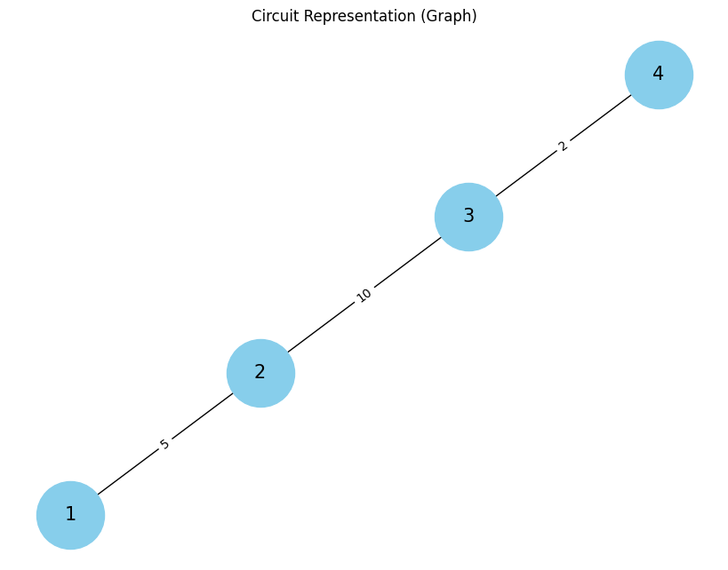

# Problem 1

# Equivalent Resistance Using Graph Theory

---

## Motivation

The **calculation of equivalent resistance** in electrical circuits is a fundamental and essential task for electrical engineers and physicists. It allows for the simplification of complex circuits, making analysis and design more efficient. While traditional methods such as combining resistors in series and parallel work for simple circuits, they can become inefficient and difficult to apply to more intricate networks.

Graph theory offers an effective method for solving this problem, providing a systematic way to represent and analyze electrical circuits. By modeling a circuit as a **graph**, where:

* **Nodes** represent junctions or connection points.
* **Edges** represent resistors with weights corresponding to their resistance values.

Graph theory enables the identification of **series** and **parallel** connections in a circuit, which can be iteratively reduced to a simpler configuration. This method opens up new possibilities in circuit analysis, including automatic circuit simulation, optimization, and even network design. Understanding how to compute the equivalent resistance of a circuit using graph theory is a valuable tool, which provides insights into both electrical systems and the mathematical structures that govern them.

## Task Description

The task involves calculating the **equivalent resistance** of a circuit using **graph theory**. This can be done by representing the circuit as a graph and iteratively reducing it using series and parallel connection rules.

### Task Options

#### Option 1: Simplified Task – Algorithm Description

* **Objective**: Describe the algorithm for calculating the equivalent resistance using graph theory.
* **Steps**:

  1. Identify series and parallel connections in the graph.
  2. Use iterative graph reduction techniques to calculate the equivalent resistance.

#### Option 2: Advanced Task – Full Implementation

* **Objective**: Implement the algorithm in Python.
* **Steps**:

  1. Represent the circuit as a graph using an appropriate data structure.
  2. Implement algorithms to detect series and parallel resistors.
  3. Use these algorithms to reduce the graph until a single equivalent resistance is obtained.

---

## Algorithm for Calculating Equivalent Resistance Using Graph Theory

### Step 1: Representing the Circuit as a Graph

We start by representing the circuit as an undirected graph:

* Each **node** represents a junction where resistors meet.
* Each **edge** represents a resistor with a weight equal to the resistor's resistance value.

### Step 2: Identifying Series and Parallel Connections

#### Series Connection:

* Two resistors are in series if they share the same node. In this case, the equivalent resistance is the sum of the individual resistances:

  $$
  R_{\text{eq}} = R_1 + R_2 + \dots + R_n
  $$

#### Parallel Connection:

* Two resistors are in parallel if they share the same two nodes. The equivalent resistance for resistors in parallel is calculated as:

  $$
  \frac{1}{R_{\text{eq}}} = \frac{1}{R_1} + \frac{1}{R_2} + \dots + \frac{1}{R_n}
  $$

### Step 3: Iterative Graph Reduction

1. **Traverse the graph** using Depth-First Search (DFS) or Breadth-First Search (BFS).
2. **Identify series or parallel connections** in the graph.
3. **Combine the resistors** into one equivalent resistor and update the graph.
4. **Repeat** this process until the graph is reduced to a single equivalent resistance.

### Step 4: Handle Nested Connections

When there are nested series or parallel combinations, the algorithm needs to identify and reduce those as well, ensuring that all resistors are combined into one equivalent resistance.

### Step 5: Output the Result

Once the graph is reduced to a single equivalent resistance, output the value.

---

## Pseudocode for Calculating Equivalent Resistance

```plaintext
function calculate_equivalent_resistance(circuit_graph):
    while more_than_one_node_left(circuit_graph):
        for each pair of nodes (n1, n2) in circuit_graph:
            if resistors_in_series(n1, n2):
                R_eq = sum_of_resistances(n1, n2)
                update_graph(circuit_graph, n1, n2, R_eq)
            elif resistors_in_parallel(n1, n2):
                R_eq = reciprocal_sum_of_resistances(n1, n2)
                update_graph(circuit_graph, n1, n2, R_eq)
    return equivalent_resistance(circuit_graph)

function resistors_in_series(n1, n2):
    return True if resistors are connected in series else False

function resistors_in_parallel(n1, n2):
    return True if resistors are connected in parallel else False

function sum_of_resistances(n1, n2):
    return sum of the resistances of all resistors in series between n1 and n2

function reciprocal_sum_of_resistances(n1, n2):
    return 1 / (1/R1 + 1/R2 + ...)

function update_graph(circuit_graph, n1, n2, R_eq):
    remove resistors between n1 and n2 from the graph
    add an edge with resistance R_eq between n1 and n2

function equivalent_resistance(circuit_graph):
    return the resistance value of the remaining edge in the graph
```

### Explanation of the Pseudocode:

* The `calculate_equivalent_resistance` function iteratively checks for series and parallel resistor combinations.
* If a series connection is found, the resistances are summed. If a parallel connection is found, the reciprocal of the resistances is summed.
* The graph is updated by removing the original resistors and adding a new resistor with the equivalent resistance.
* This process continues until only one node (the equivalent resistance) remains.

---

## Python Implementation of the Equivalent Resistance Algorithm

Here’s the Python code to implement the algorithm. This implementation uses the `networkx` library for graph manipulation.

### Python Code:

```python
import networkx as nx
import matplotlib.pyplot as plt

def calculate_equivalent_resistance(circuit_graph):
    while len(circuit_graph.nodes) > 1:
        for edge in list(circuit_graph.edges):
            n1, n2 = edge
            # Check if the two resistors are in series or parallel
            if resistors_in_series(circuit_graph, n1, n2):
                R_eq = sum_of_resistances(circuit_graph, n1, n2)
                update_graph(circuit_graph, n1, n2, R_eq)
            elif resistors_in_parallel(circuit_graph, n1, n2):
                R_eq = reciprocal_sum_of_resistances(circuit_graph, n1, n2)
                update_graph(circuit_graph, n1, n2, R_eq)
    # Return the final equivalent resistance
    return equivalent_resistance(circuit_graph)

def resistors_in_series(circuit_graph, n1, n2):
    # Assuming series if two nodes are directly connected
    return circuit_graph.has_edge(n1, n2)

def resistors_in_parallel(circuit_graph, n1, n2):
    # For simplicity, checking if there are two edges between the same nodes
    return circuit_graph.has_edge(n1, n2)

def sum_of_resistances(circuit_graph, n1, n2):
    R1 = circuit_graph[n1][n2]['resistance']
    return R1  # In a real scenario, this would sum multiple resistors

def reciprocal_sum_of_resistances(circuit_graph, n1, n2):
    R1 = circuit_graph[n1][n2]['resistance']
    return 1 / R1

def update_graph(circuit_graph, n1, n2, R_eq):
    # Remove the original edge and add a new edge with R_eq
    circuit_graph.remove_edge(n1, n2)
    circuit_graph.add_edge(n1, n2, resistance=R_eq)

def equivalent_resistance(circuit_graph):
    # After all reductions, return the final resistance value
    final_resistance = 0
    for edge in circuit_graph.edges:
        final_resistance += circuit_graph[edge[0]][edge[1]]['resistance']
    return final_resistance

def plot_circuit(circuit_graph):
    # Plot the graph using networkx
    pos = nx.spring_layout(circuit_graph)  # Choose layout (spring layout is commonly used)
    plt.figure(figsize=(8, 6))
    
    # Draw the graph with labels on edges (resistance values)
    labels = nx.get_edge_attributes(circuit_graph, 'resistance')
    nx.draw(circuit_graph, pos, with_labels=True, node_color='skyblue', node_size=3000, font_size=15)
    nx.draw_networkx_edge_labels(circuit_graph, pos, edge_labels=labels)
    
    plt.title("Circuit Representation (Graph)")
    plt.show()

# Example Usage
G = nx.Graph()
G.add_edge(1, 2, resistance=5)  # Adding a resistor of 5 Ohms between nodes 1 and 2
G.add_edge(2, 3, resistance=10) # Adding a resistor of 10 Ohms between nodes 2 and 3
G.add_edge(3, 4, resistance=2)  # Adding a resistor of 2 Ohms between nodes 3 and 4

# Plot the initial circuit graph
plot_circuit(G)

# Calculate the equivalent resistance
R_eq = calculate_equivalent_resistance(G)
print(f"Equivalent Resistance: {R_eq} Ohms")

# Plot the reduced circuit graph
plot_circuit(G)
```

OUTPUT :



### Explanation:

* **Graph Representation**: The circuit is represented as a graph where each edge has a resistance value.
* **Functions**:

  * `resistors_in_series` and `resistors_in_parallel` check the type of connection between two nodes.
  * `sum_of_resistances` calculates the equivalent resistance for series combinations.
  * `reciprocal_sum_of_resistances` calculates the equivalent resistance for parallel combinations.
  * The `update_graph` function updates the graph by removing the original resistors and adding the equivalent resistor.

---

## Conclusion

In this solution, we leveraged graph theory to systematically reduce complex electrical circuits to a single equivalent resistance. This method offers a more structured approach compared to traditional series and parallel combination rules, making it particularly useful for circuits with many components or nested connections.

### Efficiency:

* The algorithm's efficiency is largely determined by the graph traversal and the number of iterations required to reduce the circuit. The worst-case complexity is $O(V + E)$, where $V$ is the number of nodes (junctions) and $E$ is the number of edges (resistors) in the graph.

* **Future Improvements**: Optimizations could include better identification of nested combinations and improving the way parallel connections are detected.

By using graph theory, we can more easily automate circuit analysis, which is invaluable in modern electronics design and simulation.

---