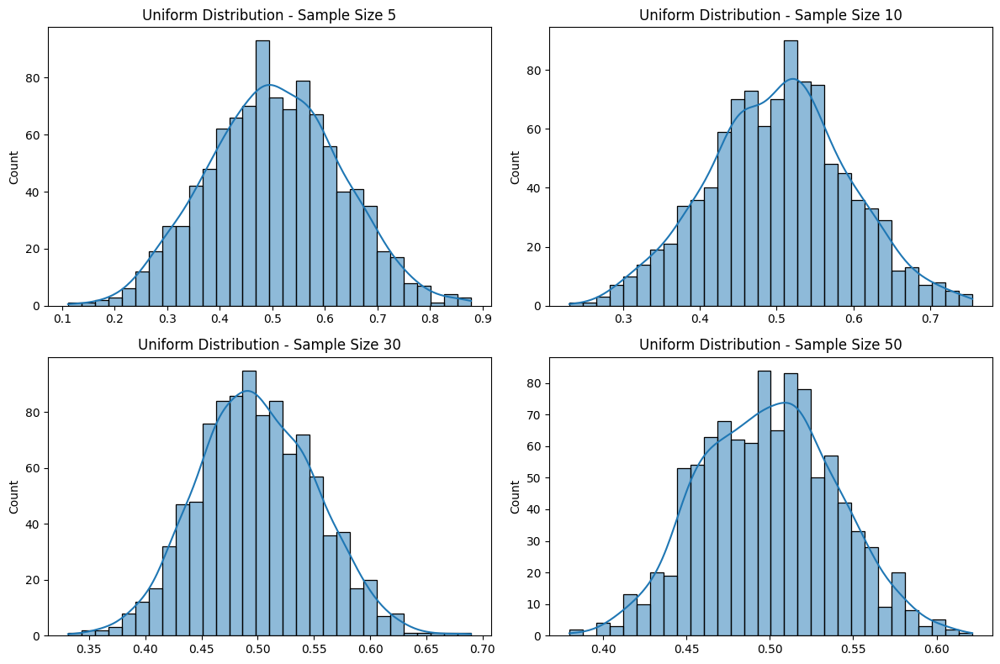
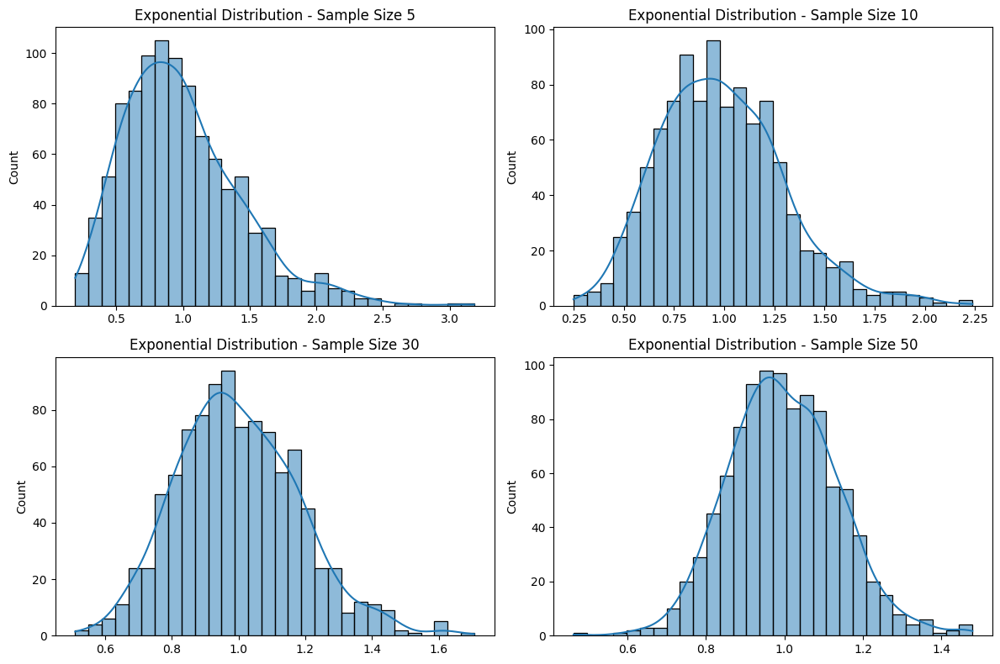
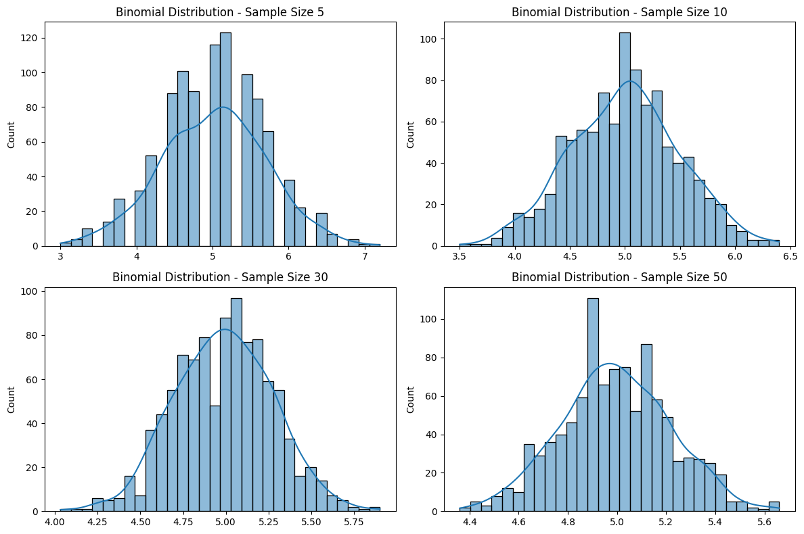

# Problem 1

# Exploring the Central Limit Theorem through Simulations

---

## Motivation

The **Central Limit Theorem (CLT)** is one of the most powerful and widely used results in probability theory and statistics. It states that:

> Given a population with any distribution having a finite mean (μ) and finite variance (σ²), the distribution of the sample means of sufficiently large random samples from the population will approximate a normal distribution, regardless of the original population’s shape.

This theorem underpins many statistical methods, including hypothesis testing, confidence intervals, and control charts. While the CLT is mathematically elegant, its true power is best appreciated through **simulation**, which brings abstract ideas to life with real data and visualizations.

---

## Objectives

1. **Simulate** different population distributions.
2. **Generate sampling distributions** of the sample mean for various sample sizes.
3. **Visualize convergence** toward normality.
4. **Analyze parameters** affecting the CLT (e.g., population shape, sample size, variance).
5. **Discuss real-world relevance** of the CLT.

---

## Task 1: Simulating Population Distributions

### Selected Distributions:

* **Uniform Distribution** \[low variance, symmetric]
* **Exponential Distribution** \[high variance, skewed]
* **Binomial Distribution** \[discrete, bounded]

```python
import numpy as np
import matplotlib.pyplot as plt
import seaborn as sns

sns.set(style="whitegrid")
np.random.seed(42)

# Create populations
N = 100_000
uniform_pop = np.random.uniform(0, 1, N)
exponential_pop = np.random.exponential(scale=1.0, size=N)
binomial_pop = np.random.binomial(n=10, p=0.5, size=N)
```

### Visualization of Original Populations

```python
def plot_populations(distributions, names):
    plt.figure(figsize=(15, 4))
    for i, (data, name) in enumerate(zip(distributions, names)):
        plt.subplot(1, 3, i+1)
        sns.histplot(data, bins=50, kde=True, color='skyblue')
        plt.title(f"{name} Population")
        plt.xlabel("Value")
    plt.tight_layout()
    plt.show()

plot_populations([uniform_pop, exponential_pop, binomial_pop],
                 ["Uniform", "Exponential", "Binomial"])
```

---

## Task 2: Sampling and Visualization

We take repeated random samples of sizes $n = 5, 10, 30, 50$ and compute the sample mean. We repeat this process $k = 1000$ times to build the **sampling distribution** of the mean.

```python
def sample_means(population, sample_size, num_samples=1000):
    return np.array([np.mean(np.random.choice(population, sample_size)) for _ in range(num_samples)])
```

### Sampling Distribution Visualization

```python
sample_sizes = [5, 10, 30, 50]

def plot_sampling_distributions(population, name):
    plt.figure(figsize=(16, 10))
    for i, size in enumerate(sample_sizes):
        means = sample_means(population, size)
        plt.subplot(2, 2, i + 1)
        sns.histplot(means, bins=30, kde=True, color='lightcoral')
        plt.title(f"{name} - Sample Size {size}")
        plt.xlabel("Sample Mean")
        plt.ylabel("Frequency")
    plt.suptitle(f"Sampling Distribution of Sample Mean ({name})", fontsize=16, y=1.02)
    plt.tight_layout()
    plt.show()

plot_sampling_distributions(uniform_pop, "Uniform")
plot_sampling_distributions(exponential_pop, "Exponential")
plot_sampling_distributions(binomial_pop, "Binomial")
```

---

## Task 3: Parameter Exploration

### A. Convergence Behavior

#### Key Observation:

* **Small sample sizes**: Sampling distribution often reflects the skewness or discreteness of the original population.
* **Large sample sizes**: Regardless of shape, the distribution of sample means approximates **normality** (bell curve).

### B. Spread vs Sample Size

The **standard deviation of the sample mean** (also called **standard error**) decreases with larger sample sizes:

$$
\text{SE} = \frac{\sigma}{\sqrt{n}}
$$

Let's demonstrate this for the exponential population:

```python
def std_error_vs_n(population, max_n=100):
    stds = []
    ns = range(1, max_n+1)
    for n in ns:
        means = sample_means(population, n)
        stds.append(np.std(means))
    return ns, stds

ns, stds = std_error_vs_n(exponential_pop)
plt.figure(figsize=(8, 5))
plt.plot(ns, stds, color='purple', marker='o')
plt.title("Standard Deviation of Sample Mean vs Sample Size")
plt.xlabel("Sample Size (n)")
plt.ylabel("Standard Deviation of Sample Mean")
plt.grid(True)
plt.show()
```
### OUTPUT :

- **Uniform Distribution**



- **Exponential Distribution**



- **Binomial Distribution**



---

## Task 4: Real-World Applications of CLT

### 1. **Survey Sampling**

Researchers can estimate the average income or preference of a population by taking a relatively small, random sample. CLT ensures that the sample mean will be a reliable estimator of the population mean.

### 2. **Quality Control**

Manufacturing industries rely on CLT when inspecting small batches of products. If the sample mean of a measured property (e.g., thickness) deviates significantly from expected values, it may indicate a problem with the entire process.

### 3. **Finance**

In portfolio theory, analysts often assume returns are normally distributed, thanks to CLT. Even if daily returns are skewed, average returns over longer periods tend to be normally distributed.

### 4. **Medical Studies**

Clinical trials use sample means to determine the average effect of a treatment. CLT justifies the use of confidence intervals and significance testing on such means.

---

## Mathematical Justification

Let $X_1, X_2, ..., X_n$ be a random sample from a distribution with:

* Mean: $\mu$
* Variance: $\sigma^2$

Then, the sample mean:

$$
\bar{X} = \frac{1}{n} \sum_{i=1}^{n} X_i
$$

has:

* Mean $\mu_{\bar{X}} = \mu$
* Variance $\sigma^2_{\bar{X}} = \frac{\sigma^2}{n}$

As $n \to \infty$, the distribution of $\bar{X} \to N(\mu, \frac{\sigma^2}{n})$

This convergence is **in distribution** (not necessarily pointwise), which means:

$$
\lim_{n \to \infty} P\left(\frac{\bar{X} - \mu}{\sigma/\sqrt{n}} \leq z\right) = \Phi(z)
$$

Where $\Phi(z)$ is the cumulative distribution function (CDF) of the standard normal distribution.

---

## ✅ Summary and Insights

| Distribution    | Original Shape    | Sample Size Needed for Normality | Comments                          |
| --------------- | ----------------- | -------------------------------- | --------------------------------- |
| Uniform         | Symmetric         | Small (n ≈ 5–10)                 | Converges quickly                 |
| Exponential     | Skewed (Right)    | Moderate to Large (n > 30)       | Needs larger n                    |
| Binomial (n=10) | Discrete, Bounded | Small to Moderate (n ≈ 10–30)    | Discrete to continuous transition |

* **Larger sample sizes** reduce the standard error and enhance the approximation to normality.
* **Skewed or discrete distributions** require **larger sample sizes** for the CLT to "kick in."
* Simulations **confirm the theory**, giving us confidence in using normal-based methods in real-world applications.

---

## Conclusion

Through this simulation-based exploration of the Central Limit Theorem (CLT), we have demonstrated one of the most remarkable phenomena in statistics: the tendency of the **sampling distribution of the sample mean to approach a normal distribution** as the sample size increases—regardless of the shape of the original population distribution.

Our experiments with **uniform**, **exponential**, and **binomial** populations illustrated key concepts:

* **Uniform distributions**, being symmetric and bounded, required only small sample sizes for the sample means to exhibit a near-normal distribution.
* **Exponential distributions**, due to their skewness and higher variance, needed larger sample sizes (n ≥ 30) to observe clear convergence toward normality.
* **Binomial distributions**, being discrete and bounded, showed a smooth transition from discrete sample means to a continuous bell-shaped curve with increasing sample size.

Moreover, we confirmed the theoretical prediction that the **spread (standard deviation) of the sampling distribution** decreases with increasing sample size, following the inverse square root relationship $\text{SE} = \sigma / \sqrt{n}$. This insight is crucial in understanding the **precision** of sample-based estimations in real-world applications.

In practical terms, the CLT allows us to apply normal-distribution-based inferential techniques even when the original data is non-normal, as long as the sample size is sufficiently large. This has widespread implications in **survey analysis, quality control, medical trials, finance,** and **machine learning**—any domain that relies on analyzing or predicting based on sample data.

Ultimately, this hands-on simulation not only reinforces the mathematical elegance of the CLT but also emphasizes its **robustness, versatility, and real-world utility**. By bridging theory and computation, we gain both intuitive and empirical understanding of why the CLT is considered a cornerstone of modern statistics.

---

