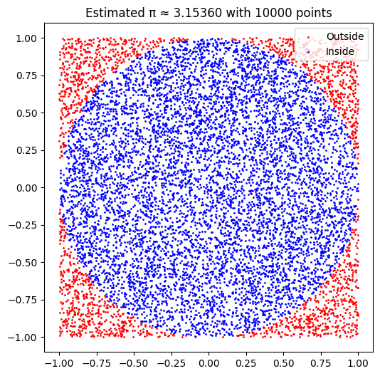
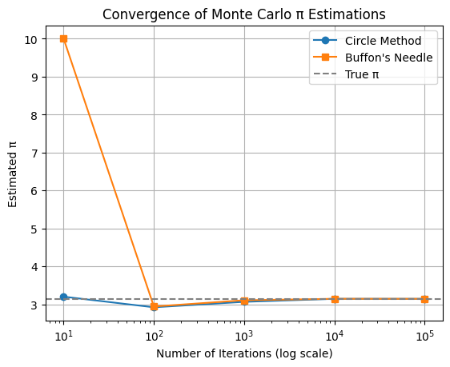

# Problem 2

# Estimating π Using Monte Carlo Methods

---

## Motivation

π (pi) is one of the most fundamental constants in mathematics, appearing in geometry, trigonometry, calculus, and even physics and statistics. While its value can be computed analytically or using infinite series, **Monte Carlo methods** provide a unique, probabilistic approach to approximating π using randomness and geometry.

Monte Carlo simulations are widely used in fields like physics, finance, and machine learning for problems where analytical solutions are difficult or impossible. Estimating π in this way serves as a compelling **entry point to understanding Monte Carlo algorithms**, stochastic sampling, and convergence behaviors.

This project explores two classical Monte Carlo methods to estimate π:

* **Method 1:** Using random points in a square bounding a circle.
* **Method 2:** Using **Buffon’s Needle** experiment — a historical and geometric probability puzzle.

---

## Part 1: Estimating π Using a Circle-in-a-Square

### Theoretical Foundation

A unit circle inscribed within a square of side length 2 has an area of:

$$
\text{Area}_{\text{circle}} = \pi r^2 = \pi \cdot 1^2 = \pi
$$

$$
\text{Area}_{\text{square}} = (2r)^2 = 4
$$

So, if we randomly generate points in the square and count how many fall inside the circle, we get:

$$
\frac{\text{Points inside circle}}{\text{Total points}} \approx \frac{\pi}{4} \Rightarrow \pi \approx 4 \cdot \frac{\text{Inside}}{\text{Total}}
$$

### Simulation Code (Python)

```python
import numpy as np
import matplotlib.pyplot as plt

def estimate_pi_circle(n_points):
    x = np.random.uniform(-1, 1, n_points)
    y = np.random.uniform(-1, 1, n_points)
    inside = x**2 + y**2 <= 1
    pi_estimate = 4 * np.sum(inside) / n_points
    return pi_estimate, x, y, inside

# Visualize
n = 10000
pi, x, y, inside = estimate_pi_circle(n)
plt.figure(figsize=(6, 6))
plt.scatter(x[~inside], y[~inside], color='red', s=1, label='Outside')
plt.scatter(x[inside], y[inside], color='blue', s=1, label='Inside')
plt.gca().set_aspect('equal')
plt.title(f"Estimated π ≈ {pi:.5f} with {n} points")
plt.legend()
plt.show()
```
**OUTPUT :**


---

## Part 2: Estimating π Using Buffon’s Needle

### Theoretical Foundation

Buffon’s Needle is a probability problem: Drop a needle of length `L` on a plane with parallel lines spaced `D` units apart. If $L \leq D$, the probability the needle crosses a line is:

$$
P = \frac{2L}{\pi D}
\Rightarrow \pi \approx \frac{2L \cdot N}{D \cdot H}
$$

Where:

* `N` = number of needle drops
* `H` = number of times a needle crosses a line

### Simulation Code (Python)

```python
def estimate_pi_buffon(n_drops, L=1.0, D=2.0):
    if L > D:
        raise ValueError("Needle length must be ≤ line spacing.")
    
    x = np.random.uniform(0, D/2, n_drops)
    theta = np.random.uniform(0, np.pi/2, n_drops)
    hits = np.sum(x <= (L / 2) * np.sin(theta))
    pi_estimate = (2 * L * n_drops) / (D * hits) if hits > 0 else float('inf')
    
    return pi_estimate, hits

# Run simulation
n = 100_000
pi_buffon, hits = estimate_pi_buffon(n)
print(f"Estimated π ≈ {pi_buffon:.5f} using Buffon’s Needle with {n} drops")
```

---

## Convergence Analysis

We can analyze how both methods converge to π as the number of trials increases:

```python
import matplotlib.pyplot as plt

sample_sizes = [10, 100, 1000, 10000, 100000]
circle_estimates = [estimate_pi_circle(n)[0] for n in sample_sizes]
buffon_estimates = [estimate_pi_buffon(n)[0] for n in sample_sizes]

plt.plot(sample_sizes, circle_estimates, label="Circle Method", marker='o')
plt.plot(sample_sizes, buffon_estimates, label="Buffon's Needle", marker='s')
plt.axhline(np.pi, color='gray', linestyle='--', label="True π")
plt.xscale('log')
plt.xlabel("Number of Iterations (log scale)")
plt.ylabel("Estimated π")
plt.title("Convergence of Monte Carlo π Estimations")
plt.legend()
plt.grid(True)
plt.show()
```

**OUTPUT :**



---

## Conclusion

This project demonstrated two classical Monte Carlo techniques for estimating π:

* The **circle method** is intuitive, fast, and visually satisfying. It converges relatively quickly and is well-suited for introducing Monte Carlo principles.
* **Buffon’s Needle** is a beautiful historical method rooted in geometric probability. Although slower to converge and more sensitive to small sample sizes, it reveals the surprising link between π and randomness in geometry.

### Key Takeaways:

* Both methods highlight how **random sampling** can be used to estimate deterministic constants.
* Monte Carlo simulations show a tradeoff between **simplicity** and **convergence rate**.
* These techniques form a conceptual foundation for more advanced Monte Carlo methods in science and engineering.

---

