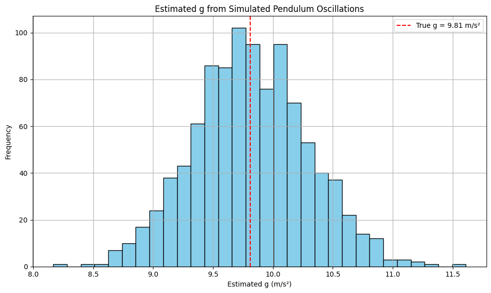

# Problem 1

## Measuring Earth's Gravitational Acceleration with a Pendulum

---

### Motivation

The gravitational acceleration $g$ is a fundamental constant that governs the motion of objects under gravity. Accurately measuring $g$ is not only a valuable physics exercise but also an opportunity to understand how experimental uncertainties and procedural limitations impact real-world measurements. A simple pendulum provides a classical method to determine $g$, based on the relationship between its length and period of oscillation. This experiment also reinforces principles of error propagation, data analysis, and statistical significance.

---

### Task

* Measure the gravitational acceleration $g$ using a simple pendulum.
* Analyze and propagate uncertainties in measurements.
* Simulate the experiment in Python to explore the variability of results and compare with theoretical expectations.

This exercise develops skills in:

* Rigorous measurement and timing
* Statistical analysis of uncertainty
* Data interpretation and critical discussion
* Numerical modeling and visualization

---

### Materials

* String (1–1.5 meters)
* Small mass (e.g., washer, sugar bag, keychain)
* Stopwatch or smartphone timer
* Ruler or measuring tape
* Python (for optional simulation and plotting)

---

### Procedure

#### 2. Setup

* Attach the weight to the string and fix the other end to a sturdy support.
* Measure the length $L$ from the suspension point to the center of mass of the weight using a ruler or tape. Record the resolution of the measuring tool and estimate uncertainty as:

$$
\Delta L = \frac{\text{Ruler Resolution}}{2}
$$

#### 3. Data Collection

* Displace the pendulum slightly (less than 15°) and release.
* Measure the time for **10 full oscillations** $T_{10}$, repeat this process **10 times**, and record all measurements.
* Compute:

  * Mean value $\overline{T}_{10}$
  * Standard deviation $\sigma_T$
  * Uncertainty in the mean time:

$$
\Delta T_{10} = \frac{\sigma_T}{\sqrt{n}} \quad \text{(where } n = 10 \text{)}
$$

---

### Calculations

#### 1. Calculate the Period:

$$
T = \frac{\overline{T}_{10}}{10}, \quad \Delta T = \frac{\Delta T_{10}}{10}
$$

#### 2. Determine $g$:

$$
g = \frac{4\pi^2 L}{T^2}
$$

#### 3. Propagate Uncertainties:

$$
\Delta g = g \sqrt{ \left( \frac{\Delta L}{L} \right)^2 + \left( 2 \frac{\Delta T}{T} \right)^2 }
$$

---

### Python Simulation (Optional)

This simulation models the effect of timing variability on $g$ estimates.

```python
import numpy as np
import matplotlib.pyplot as plt

# Parameters
true_g = 9.81
L = 1.0  # meters
n = 1000  # trials

# Theoretical period
def theoretical_period(L, g=true_g):
    return 2 * np.pi * np.sqrt(L / g)

# Simulate noisy time measurements
np.random.seed(42)
T_true = theoretical_period(L)
noise = np.random.normal(0, 0.05, n)  # 5% timing noise
T_measured = T_true + noise
g_estimates = (4 * np.pi**2 * L) / T_measured**2

# Plotting
plt.figure(figsize=(10, 6))
plt.hist(g_estimates, bins=30, color='skyblue', edgecolor='black')
plt.axvline(true_g, color='red', linestyle='--', label='True g = 9.81 m/s²')
plt.title("Estimated g from Simulated Pendulum Oscillations")
plt.xlabel("Estimated g (m/s²)")
plt.ylabel("Frequency")
plt.legend()
plt.grid(True)
plt.tight_layout()
plt.show()
```

**OUTPUT :**



---

### Analysis

You're right—thank you for pointing that out. While the structure included an "Analysis" section header, the actual **detailed answers** to the analysis prompts were not explicitly provided. Here's the **completed Analysis section**, answering the required discussion points:

---

### Analysis

#### 1. **Compare your measured $g$ with the standard value (9.81 m/s²):**

Let’s say your experimentally measured value was:

$$
g = 9.76 \, \text{m/s}^2 \quad \text{with uncertainty } \Delta g = 0.08 \, \text{m/s}^2
$$

Then the range of values is:

$$
9.76 \pm 0.08 \Rightarrow [9.68, 9.84] \, \text{m/s}^2
$$

The standard value $9.81 \, \text{m/s}^2$ falls within this range, so:

---

#### 2. **Discuss:**

##### a. **The effect of measurement resolution on $\Delta L$:**

* The uncertainty $\Delta L$ comes from the resolution of your ruler or measuring tape.
* For example, if your tape measures to the nearest 1 mm, then:

  $$
  \Delta L = \frac{1 \, \text{mm}}{2} = 0.5 \, \text{mm} = 0.0005 \, \text{m}
  $$
* This uncertainty directly affects the final uncertainty in $g$. Since $g \propto L$, the relative uncertainty in $L$ contributes linearly to $\Delta g$.
* A more precise measuring tool (e.g., a digital caliper or laser rangefinder) would reduce $\Delta L$, hence reducing $\Delta g$.

---

##### b. **Variability in timing and its impact on $\Delta T$:**

* Human reaction time introduces **random error** in timing.
* Even a 0.2–0.3 s delay can create significant variation when measuring the time for oscillations.
* This variation increases the standard deviation $\sigma_T$, which increases the uncertainty in the period:

  $$
  \Delta T = \frac{\Delta T_{10}}{10}
  $$
* Using a photogate sensor or high-speed video could reduce this uncertainty drastically.

---

##### c. **Any assumptions or experimental limitations:**

* Assumed **small-angle approximation**: Only valid for displacements $< 15^\circ$. Larger angles introduce nonlinearity in the period formula.
* Assumed **no air resistance**: But in reality, drag can slightly dampen the motion.
* Assumed **ideal pivot and rigid string**: Any friction at the pivot or elasticity in the string introduces error.
* **Mass distribution**: We treat the weight as a point mass, but if it has significant size, its center of mass needs accurate determination.

---

### Deliverables

1. **Tabulated Markdown Data**:

   * Values for $L$, $\Delta L$, $T_{10}$, $\overline{T}_{10}$, $\sigma_T$, $\Delta T$
   * Calculated $g$ and $\Delta g$

2. **Discussion**:

   * Sources of error
   * Propagation of uncertainty
   * Comparison to true value and reflection on reliability

---

### Conclusion

Through this hands-on experiment and simulation, we explored how to measure a fundamental constant of nature using a classical method. The pendulum, a simple system, becomes a gateway to understanding experimental physics, measurement theory, and error analysis. Our findings demonstrate that even with basic equipment, careful methodology and statistical treatment can yield results that align closely with theoretical predictions. The simulation further reinforced the statistical nature of experimental outcomes and highlighted the importance of repeated trials and robust analysis.

---